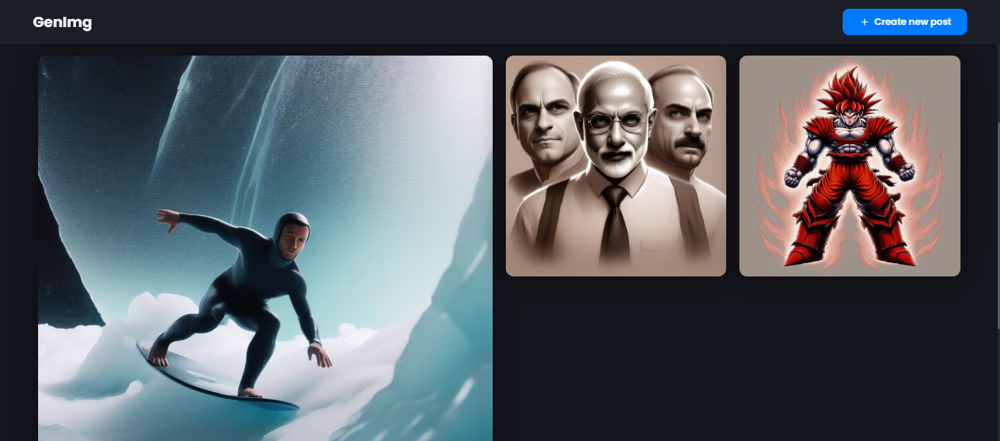
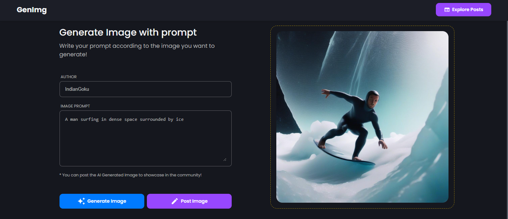
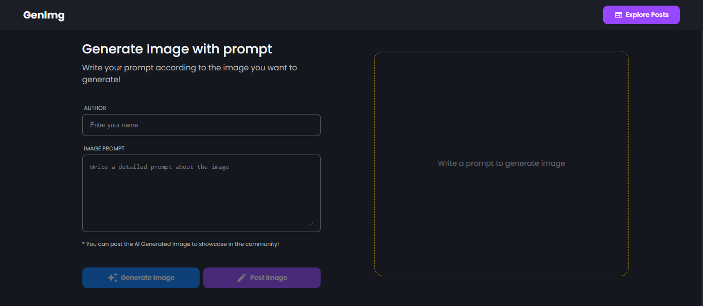

<h1 align="center">GenImg - Digital Creation</h1>

    <em>Transforming your imagination into stunning visuals with the power of AI.</em>

    
    
    
    
    

---

## 🚀 Application Showcase

Experience the magic of AI-generated images! Below are some snapshots of Genimg's sleek interface and powerful capabilities:

---

## 🎨 Overview

**GenImg** is a cutting-edge web application that utilizes Hugging Face AI to generate breathtaking images from textual prompts. Whether you're an artist, a marketer, or simply exploring digital creativity, Genimg is designed to transform your ideas into visual masterpieces with ease.

---

## ✨ Features

#### **💡 Intelligent Image Generation:**

Bring your imagination to life with **Genimg's** advanced AI models. Enter a text prompt, and watch as the app creates stunning images tailored to your description.

#### **💾 Persistent Photo Album:**

Save your creations effortlessly. Genimg stores your image history, allowing you to view, save, or delete images at your convenience By using Cloudinary.

#### **📂 Quick Save:**

Download the images to continue your creative journey! All images are uploaded to your **Cloudinary** platform for secure and efficient access.

---

## 🌐 Tech Stack

Genimg is built with modern web technologies to ensure efficiency, responsiveness, and style:

- **React**: To create interactive UIs with reusable components.
- **Hugging Face AI**: Powering the AI backend with image generation.
- **Typescript**: Ensuring type safety and code reliability.
- **Express.js**: Managing server-side logic.
- **Node.js**: backend runtime environment.

---

## 🤝 Contributing

**We welcome contributions** to enhance **Genimg**. Here's how you can help:

- ⭐ Fork this repository
- 📩 Submit Pull Requests
- 🐛 Report issues or suggest new features.

---

## 🙌 Acknowledgments

Special thanks to the following resources that made this project possible:

- **<a href="https://youtu.be/stcihX2eavw?si=DPS8GeMBN3I6aRmn" target="_blank">GeeksforGeeks</a>** for the UI inspiration.

- **<a href="https://huggingface.co/" target="_blank">Hugging Face AI</a>** for image generation.

- **<a href="https://chatgpt.com/" target="_blank">ChatGPT</a>** for assistance and guidance.

- **<a href="https://stackoverflow.com/" target="_blank">Stack Overflow</a>** for invaluable coding solutions and discussions.

